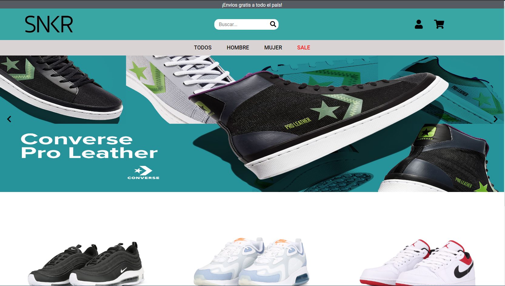
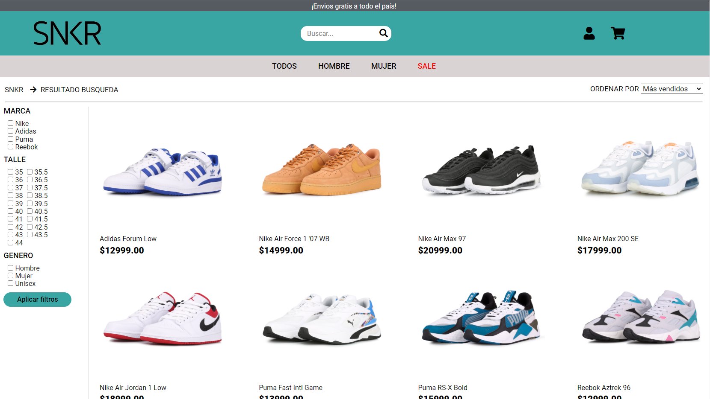

# grupo_7_SNKR

This is an E-commerce that was built following MVC design patterns and using MySQL, Sequelize, Express, Node Js, JavaScript, CSS, HTML. During the project, we use agile methodology SCRUM.

  

 
 

  

 

Our site will focus on the marketing of exclusive and/or imported sneakers, providing completely original products. The product is aimed at a knowledgeable audience in the market, collectors of sports footwear, always looking for exclusive models. We are dedicated to the SneakerHead culture.

Team:

Cristian Villafane: I am 35 years old, I live in Lanus. I am a fan of Boca Juniors. I really enjoy sports in general, particularly football, swimming, and gym.

Mauricio Silvera: I am 23 years old, I live in Floresta. I work in IT and I like to spend most of my day on the PC playing video games and chatting with friends. Despite the latter, I also like to practice sports on weekends.

Renzo Pianciola: I live in the city of Olavarría, Buenos Aires. I am 28 years old, a Physical Education teacher. I also work as a DJ and I am dedicated to music production.

Nicolas Macenco: They call me Nico, I am 29 years old. I graduated from the accounting career. I am from Neuquén but currently living in Mendoza. I really enjoy sports and spending time with my family and friends.

Reference pages:

https://www.grid.com.ar/: Currently one of the main pages in Argentina dedicated to the retail sale of sports clothing and footwear, a great reference for the audience we are targeting. It has a good yellow aesthetic based on its logo, which could be useful in case of choosing a logo color.

https://www.dafiti.com.ar/: It is related to the product we chose and also has all the elements that we have planned to implement. It is a great reference.

https://www.converse.com.ar/: Although the page does not have online sales, we thought it was a reference in the sneaker market. We liked the simplicity of the site.

https://drifters.com.ar/: Clothing sales platform with a large offer in the footwear sector, which is our focus. Its navigation is intuitive and we found it suitable to have as a reference and take some ideas.

https://www.moovbydexter.com.ar/: Along with Grid, it currently has the largest sneakerhead audience due to its exclusive releases, mostly recognized for its sneakers. It has a minimalist Black&White design with very neat and pleasant animations for the end-user, which we can use as a guide.

Wireframes:

● Home: https://www.figma.com/file/8wOfDx8G1g5IDUfF03toOk/SNKR-Home?node-id=0%3A1

• Product search: https://www.figma.com/file/MqJ7Ir5zlcuEMQvOucV1O6/SNKR-2?node-id=0%3A1

● Product detail: https://www.figma.com/file/BSsMHn7TBaFRl8WpaXbrRL/SNKR?node-id=0%3A1

● Shopping cart: https://www.figma.com/file/3Y5lyFn212KNSMx6m45HLZ/SNKR?node-id=0%3A1

● Registration form: https://www.figma.com/file/mbUHVOIU3O2sCQDRs6HodF/Pantalla-de-Registo?node-id=0%3A1

● Login form: https://www.figma.com/file/hixK78wP7JLIUsMTztvfR8/Pantalla-de-Logue?node-id=0%3A1